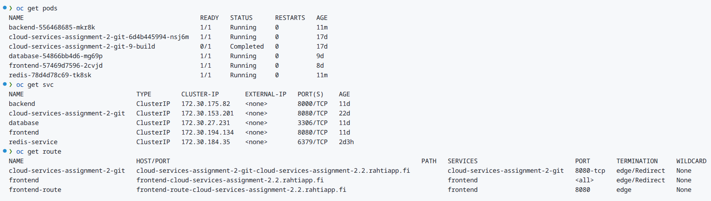
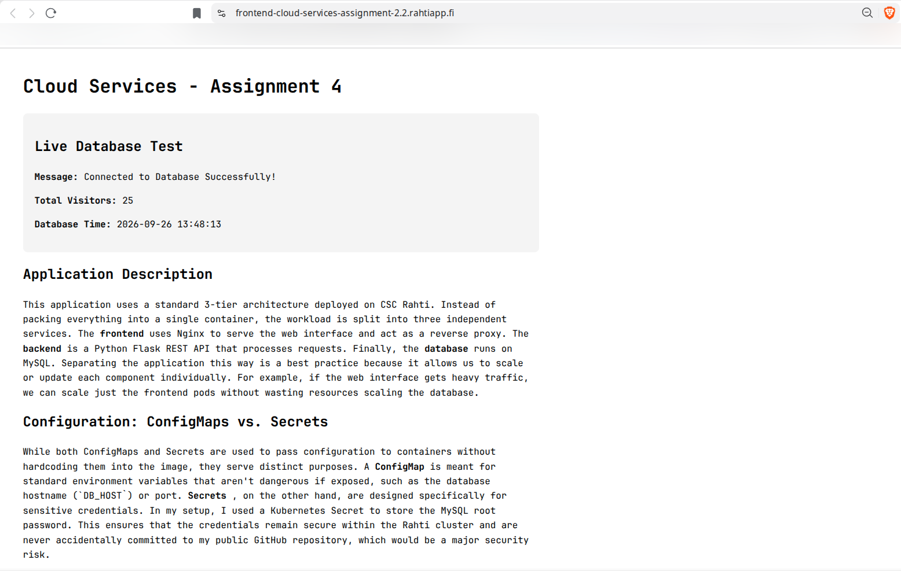
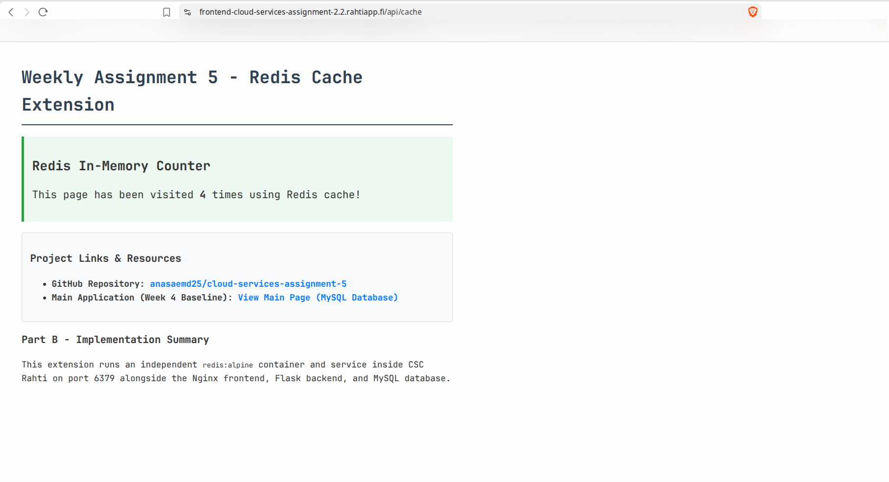

# Weekly Assignment 5 - Cloud Services

## Live Application & Repository Links

- **Live Redis Cache Endpoint (Week 5 Extension):** https://frontend-cloud-services-assignment-2.2.rahtiapp.fi/api/cache
- **Main Application (Week 4 Baseline):** https://frontend-cloud-services-assignment-2.2.rahtiapp.fi/
- **GitHub Repository:** https://github.com/anasaemd25/cloud-services-assignment-5

---

## Part A - Questions

### 1. What is YAML and why has it become the default configuration format for Kubernetes/Rahti manifests? Compare it briefly to JSON.

YAML (YAML Ain't Markup Language) is a human readable data serialization standard commonly used for configuration files. It became the default option for Kubernetes and Rahti because its clean structure relies on line indentation instead than brackets or commas, making the complex cluster definitions easier to read and maintain. Unlike JSON, YAML supports comments and has a minimal syntax. Behind the scenes, Kubernetes converts YAML manifests into JSON before applying them.

### 2. What is a Web Application Firewall (WAF) and what kinds of attacks does it defend against? Where would you place one in the three-container architecture built in Week 4?

A Web Application Firewall inspects and filters incoming HTTP/HTTPS traffic to block malicious exploits before they reach the web application. It defends against OWASP top threats like SQL Injection, Cross-Site Scripting (XSS), and automated bot attacks. In the Week 4 architecture (`Route → Frontend → Backend → Database`), a WAF would be placed at the edge of the network,right before or integrated into the public Route/Frontend, protecting Nginx and Flask from direct application layer attacks.

### 3. Explain the difference between SAML and OAuth. When would a company choose one over the other?

Security Assertion Markup Language is an XML based framework focused on **Authentication** (verifying identity) for Enterprise Single Sign-On (SSO). OAuth is an open standard focused on **Authorization** (for granting access permissions without sharing user credentials). A company chooses SAML for internal corporate login systems across employee software, but OAuth is chosen when building web applications that allow users to sign in via 3rd party providers (like MIcrosoft or Google) or when managing API access tokens

### 4. What are open data portals and why does choosing the right open-data format matter for reuse?

Open data portals are public platforms that store freely accessible datasets provided by governments and public figures. Choosing standard, machine readable formats like JSON, CSV, or GeoJSON is important for reuse, because software applications can parse and process data automatically. Unstructured formats like PDFs or images block automation and require manual extraction.

---

## Part B - Hands-On: Extend Orchestrated App (Redis Cache)

### 1. Architectural Changes

A dedicated Redis container (`redis:alpine`) was added to the multi-container architecture. It runs as an independent Kubernetes Deployment and Service (`redis-service`), exposing port `6379`. The Flask backend connects to `redis-service:6379` to perform fast in-memory key increment operations (`INCR`) without querying MySQL.

### 2. Cluster Verification (Pods & Services)

Both the baseline Week 4 stack (Frontend, Backend, MySQL DB) and the new Redis extension run concurrently as separate Kubernetes objects:

- `oc get pods`: Shows `backend`, `frontend`, `mysql`, and `redis` pods in `Running` state.
- `oc get svc`: Confirms `redis-service` exposes port `6379` internally to the cluster.

_(Place your terminal screenshot here: `screenshots/oc-status.png`)_

### 3. Verification of Week 4 Baseline

The primary application (`/`) connected to MySQL continues to function properly, maintaining database persistence across pod restarts while `/api/cache` handles fast in-memory counts.

### 4. Problems Encountered & Technical Solution

**Issue:** When accessing `/api/cache`, Flask threw an `HTTP 500` error with the trace:
`redis.exceptions.ResponseError: MISCONF Redis is configured to save RDB snapshots, but it's currently unable to persist to disk.`

**Root Cause:** By default, Redis tries to save RDB snapshots to disk when write commands (like `INCR`) occur. Because OpenShift/Rahti enforces strict security policies restricting unmounted disk write permissions, Redis failed to save snapshots and blocked write operations.

**Solution:** Updated `rahti/redis-deployment.yaml` to run Redis purely in-memory by disabling disk snapshotting using container arguments:

```yaml
containers:
- name: redis
  image: redis:alpine
  command: ["redis-server"]
  args: ["--save", ""]
```

### Implementation Evidence

#### 1. OpenShift/Rahti Cluster Status (Pods & Services)


#### 2. Week 4 Baseline Application Verification (MySQL)


#### 3. Redis Cache Endpoint Verification
