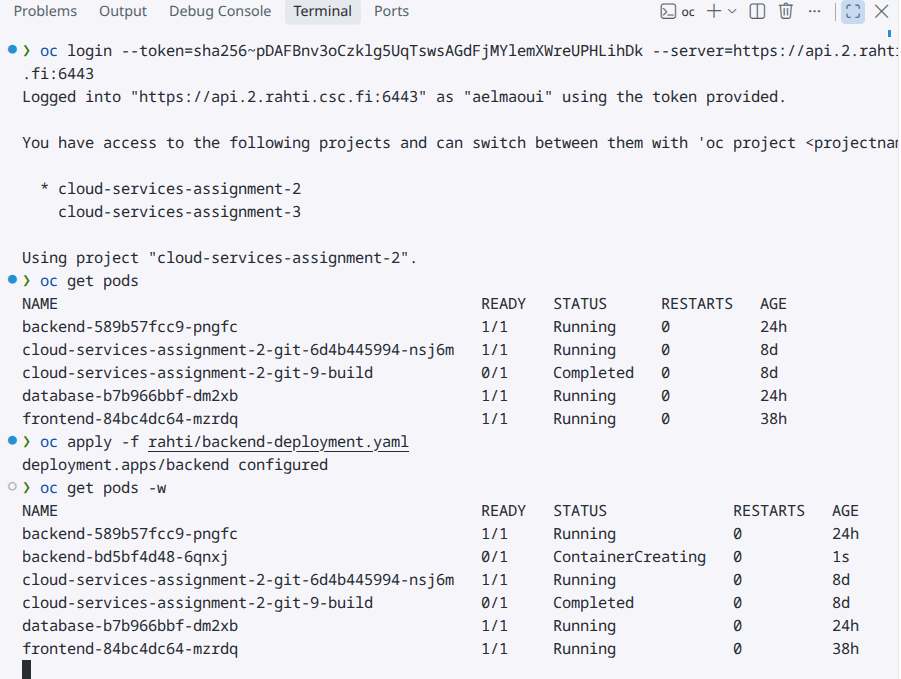
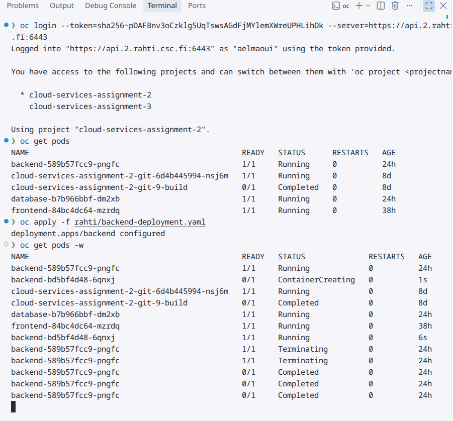
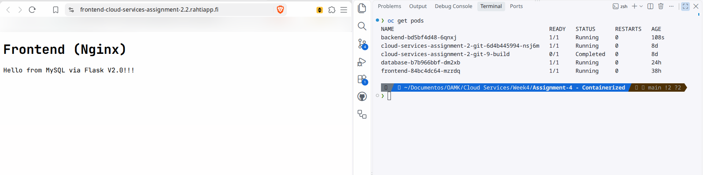

# Assignment 4 - Containerized 3-Tier Application on CSC Rahti

## Application Description

This application uses a standard 3-tier architecture deployed on CSC Rahti. Instead of packing everything into a single container, the workload is split into three independent services:

- **Frontend**: Uses Nginx to serve the web interface and act as a reverse proxy. Exposed to the internet via a Rahti Route.
- **Backend**: A Python Flask REST API running inside the internal cluster network that processes requests.
- **Database**: A MySQL 8.0 database.

Separating the application this way is a best practice because it allows us to scale or update each component individually. For example, if the web interface gets heavy traffic, we can scale just the frontend pods without wasting resources scaling the database.

**Live URL**: http://frontend-cloud-services-assignment-2.2.rahtiapp.fi

---

## Configuration: ConfigMaps vs. Secrets

While both ConfigMaps and Secrets are used to pass configuration to containers without hardcoding them into the image, they serve distinct purposes.

- **ConfigMap (`app-config`)**: Meant for standard environment variables that aren't dangerous if exposed, such as the database hostname (`DB_HOST`) or port.
- **Secret (`generic-mysql-secret`)**: Designed specifically for sensitive credentials like `MYSQL_ROOT_PASSWORD`.

By using a Secret, I ensured that my database credentials remain secure within the Rahti cluster and are never accidentally committed to my public GitHub repository, which would be a major security risk.

---

## Database Persistence

Data persistence works very differently in a cloud orchestration platform compared to local development. When using Docker Compose locally, the database volume is typically just a folder mapped to the host laptop's hard drive. However, in a clustered environment like Rahti, pods are ephemeral and can be moved between different physical servers at any time.

To solve this, Rahti uses a **PersistentVolumeClaim (PVC)**, which acts as network-attached storage. If the physical node running my MySQL pod crashes, the cluster will automatically recreate the pod on a healthy node and reattach the exact same PVC over the network, ensuring zero data loss.

---

## Orchestration Experiments

### 1. Pod Recovery (Self-Healing)

- **Action**: I manually deleted the running backend pod using the OpenShift CLI.
- **Result**: Rahti instantly noticed the pod was missing and automatically spun up a replacement pod.
- **Explanation**: This behavior happens because of the Kubernetes **Deployment** and **ReplicaSet** controllers. They constantly monitor the cluster's state to ensure the desired number of replicas matches the actual number of running pods. When the pod was deleted, the controller immediately intervened to restore the desired state.

### 2. Scaling

- **Action**: I scaled the backend deployment from 1 to 3 replicas.
- **Result**: Three identical backend pods started running simultaneously.
- **Explanation**: Even though there are now three different backend pods with three different IP addresses, the frontend doesn't need to know any of them. The frontend simply sends its requests to the internal **Service** name. The Kubernetes Service acts as an internal load balancer, automatically distributing the incoming API requests across all three healthy backend pods.

### 3. Database Persistence

- **Action**: I deleted the active MySQL database pod.
- **Result**: A new database pod was automatically created. Once it started, it reconnected to the network storage (PVC). When I refreshed the webpage, the visitor counter and previous data were still there, proving that the data survived the pod destruction.

### 4. Application Update

- **Action**: I updated the backend application code, pushed a new image tag to Docker Hub, and applied the updated deployment file to Rahti.
- **Result**: Rahti performed a **Rolling Update**. Instead of taking the application offline, it started creating the new container version first. Only after the new container was fully running and healthy did it terminate the old one, ensuring zero downtime for the end users.

**Update Initiated (`ContainerCreating`)**:

**Update Completed (`Terminating` / `Completed`)**:

**Web App V2.0 Verification**:

---

## Platform Comparison: Rahti (PaaS) vs. cPouta (IaaS)

Deploying this application on Rahti (PaaS) was a completely different experience compared to the previous cPouta (IaaS) exercise.

- **IaaS (cPouta)**: I had to manually spin up a virtual machine, configure the operating system, install Docker, and manage firewall rules manually. It required a lot of system administration overhead.
- **PaaS (Rahti)**: Built on OpenShift/Kubernetes, Rahti abstracts all of that hardware and OS management away. I only needed to provide my container images and declarative YAML files. Rahti automatically handled the internal DNS routing between my containers, provided a public HTTPS route out of the box, and offered built-in load balancing and self-healing.

---

## Problems Encountered and Solutions

- **Problem**: During the initial setup, I realized I had plain text database passwords stored directly inside my configuration files.
- **Solution**: Hardcoding credentials is a bad practice, so I removed them immediately. I created a Rahti Secret object to hold the passwords securely and referenced them in my deployment files via environment variables. Finally, I added a `.gitignore` file to ensure my local `.env` files would never be pushed to my public GitHub repository.
