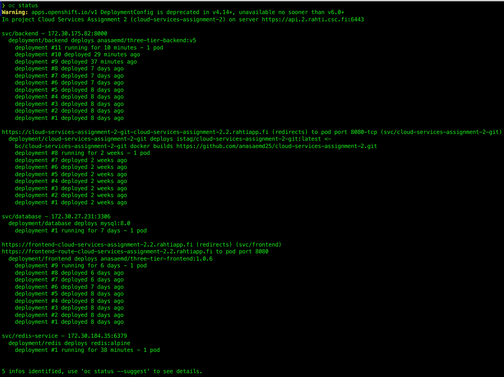
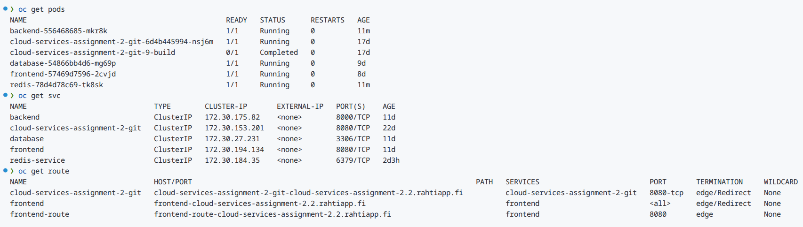
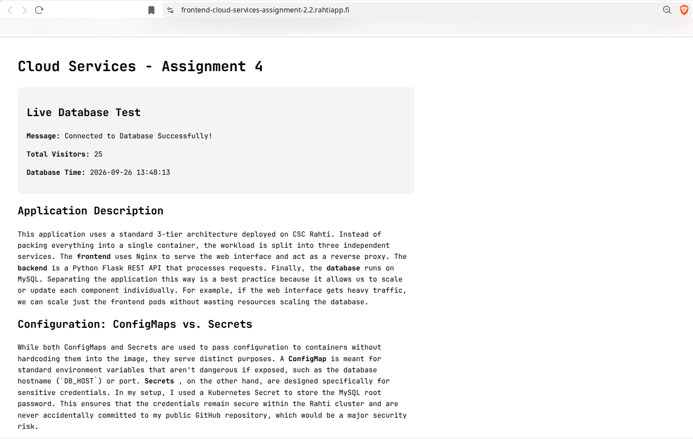
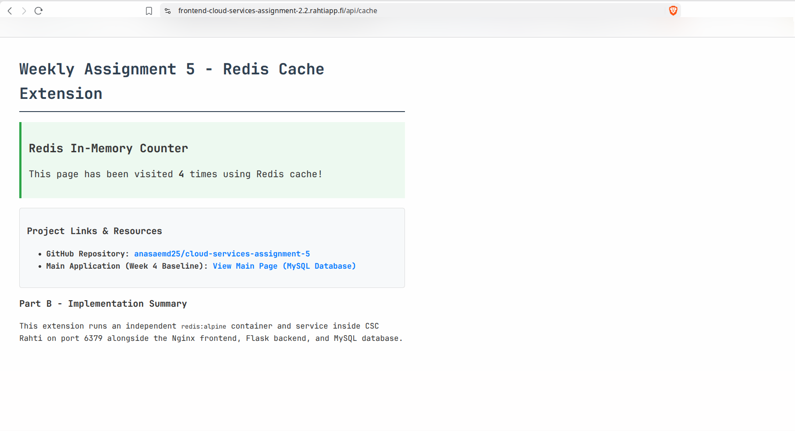

# Weekly Assignment 5 - Cloud Services

## Live Application & Repository Links

- **Live Redis Cache Endpoint (Week 5 Extension):** https://frontend-cloud-services-assignment-2.2.rahtiapp.fi/api/cache
- **Main Application (Week 4 Baseline):** https://frontend-cloud-services-assignment-2.2.rahtiapp.fi/
- **GitHub Repository:** https://github.com/anasaemd25/cloud-services-assignment-5

---

## Executive Summary & System Architecture

This project builds upon the 3-tier containerized architecture established in Week 4 (Nginx Frontend, Flask Backend REST API, and MySQL Persistent Database) by extending it with an independent, high-performance **Redis in-memory caching layer** deployed on CSC Rahti (OpenShift/Kubernetes platform). 

The goal of the Assignment is to:
1. Provide comprehensive theoretical analysis (Part A) on cloud configuration formats (YAML vs. JSON), Security frameworks (WAF, SAML vs. OAuth), and Open Data standards.
2. Hands-on deployment (Part B) of an standalone Redis service (`redis:alpine`) that handles atomic sub-millisecond hit counters (`INCR page_views`) without offloading overhead or read/write stress to the primary MySQL relational database.

---

## Part A - Theoretical Research & Cloud Concepts

### 1. What is YAML and why has it become the default configuration format for Kubernetes/Rahti manifests? Compare it briefly to JSON.

YAML (YAML Ain't Markup Language) is a human readable data serialization standard commonly used for writing cluster configuration files and deployment manifests. It has become the standard choice for Kubernetes and OpenShift/Rahti because it structure relies on strict line indentation rather than explicit syntax tokens like curly braces (`{}`), brackets (`[]`), or trailing commas. This clean formatting makes complex multi resource definitions significantly easier to create, read, and maintain in version control systems.

Key differences between YAML and JSON include:
- **Comments Support:** YAML natively supports inline and block comments (`#`), which are essential for documenting declarative infrastructure configurations. JSON doesn't support comments natively.
- **Syntax Verbosity:** YAML skips quotes for strings and structural delimiters, making manifests less cluttered than equivalent JSON definitions.
- **Internal Cluster Processing:** While human developers work with YAML for readability, Kubernetes controllers internally convert YAML manifests into JSON objects before submitting them to the API server engine.

---

### 2. What is a Web Application Firewall (WAF) and what kinds of attacks does it defend against? Where would you place one in the three-container architecture built in Week 4?

A Web Application Firewall (WAF) is an application layer (Layer 7) security barrier that inspects, monitors, and filters incoming HTTP/HTTPS traffic between web clients and web application servers. Unlike traditional network firewalls that filter traffic based on IP addresses and ports (Layer 3/4), a WAF inspects the full payload of application requests to block malicious exploits before they reach backend logic.

A WAF defends against common OWASP Top 10 web application vulnerabilities, including:
- **SQL Injection (SQLi):** Malicious SQL statements injected into user input fields to bypass authentication or extract database contents.
- **Cross-Site Scripting (XSS):** Malicious scripts injected into client responses to compromise user sessions.
- **Automated Bot Attacks & Rate Abuse:** Volumetric application-level DDoS and brute-force access attempts.

**Placement in Architecture:**
In our 3-tier container stack (`Route → Frontend (Nginx) → Backend (Flask) → Database (MySQL)`), the WAF must be placed at the edge of the public network positioned directly in front of or integrated as a module within the public OpenShift Route and Nginx Reverse Proxy. This ensures all external inbound web traffic is sanitized before hitting Nginx or triggering processing overhead inside the Flask API containers.

---

### 3. Explain the difference between SAML and OAuth. When would a company choose one over the other?

Security Assertion Markup Language (SAML) and Open Authorization (OAuth) are standard protocols used for access control in modern software, but they serve fundamental, distinct security purposes:

- **SAML (Authentication Focus):** SAML is an XML based protocol designed for **Authentication** (verifying *who* a user is). It enables Single Sign-On (SSO) across enterprise software applications by exchanging signed XML security tokens between an Identity Provider (IdP) and a Service Provider (SP).
- **OAuth (Authorization Focus):** OAuth is an open HTTP/JSON-based framework designed for **Authorization** (granting permission to access resources without exposing user credentials). It grants scoped access tokens to third-party applications.

**When a Company Chooses One over the Other:**
- **Choose SAML:** When establishing enterprise wide SSO for internal corporate employees across workforce management software (granting employees single-login access to Slack, Salesforce, and HR systems through Azure AD or Okta).
- **Choose OAuth:** When building public or mobile web applications that require delegated access to user resources or third-party logins ( letting users log into a web service using their existing Google, GitHub, or Microsoft accounts).

---

### 4. What are open data portals and why does choosing the right open-data format matter for reuse?

Open data portals are centralized, publicly accessible web platforms operated by government institutions, research organizations, and municipalities to freely distribute official datasets to citizens, researchers, and software developers.

Choosing the right open data format is critical for data reuse and interoperability:
- **Machine-Readable Standard Formats (JSON, CSV, GeoJSON, XML):** These structured formats allow software applications, automated scripts, and analytics pipelines to ingest, parse, clean, and process data programmatically without manual intervention.
- **Unstructured / Proprietary Formats (PDFs, Scanned Images, Proprietary Binary Documents...):** Proprietary or non machine-readable formats create operational bottlenecks, preventing automated ingestion and forcing developers to perform manual web scraping or Optical Character Recognition (OCR), which introduces errors and limits automated scalability.

---

## Part B - Hands-On: Extend Orchestrated App (Redis Cache)

### 1. Architectural Extension Overview

To enhance application responsiveness and demonstrate multi-service orchestration in OpenShift/Rahti, a fourth container was added to the Week 4 infrastructure: an independent **Redis Cache** engine (`redis:alpine`). 

- **Independent Deployment & Service:** Redis operates as its own dedicated Kubernetes Deployment (`redis-deployment.yaml`) and exposes an internal cluster Service (`redis-service`) on TCP port `6379`.
- **Decoupled Workload Pattern:** The Flask backend communicates with `redis-service:6379` using the `redis-py` client library. Every HTTP request to `/api/cache` triggers an atomic in-memory increment (`INCR page_views`), delivering sub-millisecond execution speeds without querying the persistent MySQL database.

---

### 2. Problems Encountered & Technical Solution

#### Issue Description
Upon initial deployment of the Redis endpoint (`/api/cache`), the Flask backend returned an `HTTP 500 Internal Server Error` with the following Python exception trace:

```text
redis.exceptions.ResponseError: MISCONF Redis is configured to save RDB snapshots, but it's currently unable to persist to disk.
```

### Root Cause Analysis

By default, standard Redis instances attempt to save background RDB snapshot files (`dump.rdb`) to local disk storage whenever write/increment commands occur. However, CSC Rahti applies strict Security Context Constraints (SCC) that restrict write permissions on container root filesystems when no Persistent Volume Claim (PVC) is explicitly mounted to the container path. Because snapshot persistence failed, Redis entered a write-protection state and rejected inbound commands.

#### Applied Solution

Since the page view counter is intended as an ephemeral, high-speed cache rather than a persistent database, disk snapshotting was disabled. The container definition inside `rahti/redis-deployment.yaml` was updated to pass the `--save ""` argument directly to the `redis-server` startup command:

```yaml
apiVersion: apps/v1
kind: Deployment
metadata:
  name: redis
spec:
  replicas: 1
  selector:
    matchLabels:
      app: redis
  template:
    metadata:
      labels:
        app: redis
    spec:
      containers:
      - name: redis
        image: redis:alpine
        command: ["redis-server"]
        args: ["--save", ""]
        ports:
        - containerPort: 6379
```

This forces Redis to run strictly in memory, completely bypassing disk persistence requirements and resolving the write error.

## Comprehensive Implementation Evidence & Verification

### 1. OpenShift / Rahti Cluster Status & Active Pods


*Figure 1: OpenShift CLI (`oc get pods` & `oc get svc`) terminal verification.*

**Detailed Analysis:** This terminal capture verifies that all four application components are running simultaneously inside the cluster project. It confirms that the newly added `redis` pod is in the `Running` state alongside `backend`, `frontend`, and `mysql`. Furthermore, `oc get svc` proves that `redis-service` correctly exposes port `6379` internally for intra-cluster network communication with the Flask REST API.

### 2. Standalone Pod & Service Orchestration Detail


*Figure 2: Comprehensive OpenShift pod status and internal cluster topology.*

**Detailed Analysis:** This status screenshot provides granular cluster evidence demonstrating that the Redis extension operates as a standalone deployment (`redis-78d4d78c69-tk8sk`). It confirms that each tier maintains its own dedicated resource boundaries, IP assignments, and restart policies, validating best practices for cloud-native container separation.

### 3. Week 4 Baseline Application Verification (MySQL Main Page)


*Figure 3: Verification of the main application connected to the persistent MySQL database.*

**Detailed Analysis:** This screenshot verifies non-regression of core baseline functionality. Adding the Redis caching service did not break or disrupt the primary application route (`/`). The Nginx frontend successfully connects to the Flask API, which continues to write visitor records to the persistent MySQL database backend and calculate accurate visitor totals across pod restarts.

### 4. Redis Cache Endpoint Verification (`/api/cache`)


*Figure 4: Live web interface rendered by the `/api/cache` route.*

**Detailed Analysis:** This screenshot shows the live web response when navigating to `https://frontend-cloud-services-assignment-2.2.rahtiapp.fi/api/cache`. The page displays the real-time incrementing hit counter powered by Redis in-memory key storage (`INCR page_views`), complete with architectural summary details, links back to the main MySQL baseline, and embedded repository references.
